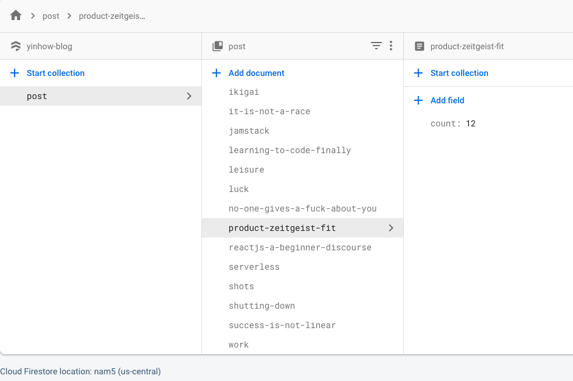

I wanted to add a **like counter** at the end of every blog post that tracks how many people like it. 

Since there is no server or database to this blog, I decided to give Netlify Function a try. 

Netlify Function is essentially a wrapper around AWS Lambda that provides a node.js runtime to execute your serverless function.

You can use it to do things you'd rather your front-end app doesn't do:

1. perform cron job such as scraping/pulling in Twitter/Instagram posts
2. perform event-triggered update to database
3. resize images uploaded to an S3 bucket

...

Our use case is super simple - just a simple database that keeps count of each page's like count (we can probably use Google Sheet), and functions to read and update from the db.

Initially, I explored using Netlify's FaunaDB addon. But the documentation for FaunaDB is confusing, so I switched to the more familiar Google Firestore.

This is how our entire Firestore database looks like - just a collection of blogpost documents, each with a "count" field:



...
<h3>Direct app to DB</h3>

Originally, the frontend calls the firestore directly to read and update directly. 

```jsx
//Get Like

const [like, setLike] = useState(0); //local state for "likes"

useEffect(() => {
	//fetch like from firestore when the page component loads
	const fetchLike = () => {
	  firebase.firestore().collection('post').doc(slug).get()
	  .then(function(post) {
	      if (post.exists) {
	        setLike(post.data().count);  //update state 
	      } else {
	        setLike(0);  //if no like
	      }        
	  })
	  .catch(function(error) {
	    console.log(error)
	  })
	}

	fetchLike();
}, [post.fields.slug])
```
<br />

```jsx
//Update Like

const updateLike = () => {
	firebase.firestore().collection("post").doc(slug).set({
	  count: like + 1
	})  //the .set() method will update count in db 
	// and if slug doesn't exist, will create the slug document and add count

	setLike(like + 1)
}
// pass above method to a child component
<Heart updateLike={updateLike} />
```
<br />

It works, but I have a nagging feeling this is not the most secure approach since Firebase API Key might be exposed.

...

<h3>using Netlify Function</h3>

So I moved on to using netlify function.

Setup is simple, create a function folder at the root level (not inside /src), and point to that folder from Netlify admin dashboard.

Initially, I wasn't sure how **dependencies** are handled in serverless - since the functions are running in a separate environment with no access to all our node modules. The dependency I need here is Firebase client library.

Turns out that at build-time, Netlify will separately install the dependencies you need in your serverless functions, as long as your function folder is at the same root level as node_modules folder.

Similar to most hosting platforms, you can use environment variables provided by Netlify to inject API keys etc.

Netlify function also generates an api end-point that frontend can call, e.g. to fetch like on mount, I call https://yinhow.com/.netlify/functions/fetchLike?slug=hello-world (not in use)

...

<h3>The anatomy of a Lambda function:</h3>

- when your function is invoked, the runtime executes the handler method
- the handler method receives 3 arguments: event, context, callback
- in our case, we get the query string parameter from event argument
- if you're using async, don't use callback in your function
- to return data from serverless function, the data in body needs to be converted to string using JSON.stringify()

```js
//fetchLike
var firebase = require("./serverlessConfig")

exports.handler = async function(event, context, callback) {
    const slug = event.queryStringParameters.slug

    const count = await firebase.firestore().collection('post').doc(slug).get()
    .then(function(post) {
    	return post.data().count
    })

    return {
    	statusCode: 200,
    	headers: {
			"Access-Control-Allow-Origin": "*",
			"Content-Type": "application/json"
		},
    	body: JSON.stringify({
    		message: "success",
    		input: count
    	})
    }
}
```
<br />

Along the way, I encountered 2 noob errors:

1 - Managed to read firebase data on netlify console, but the lambda function call timed out. It's probably something wrong with my use of async/await. Anyway, I did a manual fix by adding 'context.callbackWaitsForEmptyEventLoop = false;' to get out of node event loop. 

**Update**: turns out the issue is that I should **not use callback method in async handler**. In async, we just need to return a response, error, or promise. Only use callback in non-async handler function.

2 - I had 2 separate function files (fetchLike.js, updateLike.js), both with Firebase config and initialising at the top of the function. This is because i wasn't sure whether a function in an isolated cloud environment can handle imports from another file. 

But this caused some "Firebase duplicate app error" which means I shouldn't be initialising firebase twice. This is solved by extracting the config into a different function file and importing/requiring it.

...

Netlify function is pretty neat and easy to use. But in the end, I decided **not** to use serverless since it seems like an overkill for what I need - some light-weight functions that are not auto/event-triggered. 

Upon further research, it seems that it is not a security risk for someone to know Firebase api key. In fact, it is supposed to be exposed to frontend app, like an API endpoint. The recommended way to secure your setup is simply to configure firebase security rules in your firebase dashboard, or use tokens for access.
