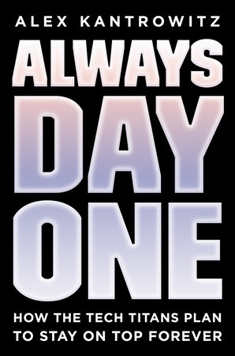

Always Day One: How the Tech Titans Plan to Stay on Top Forever - book by Alex Kantrowitz

What do YouTube, Instagram, Whatsapp, Twitch, Linkedin, and Github have in common?  

They were all **acquired** by Big Tech (Apple, Microsoft, Google/Alphabet, Facebook, Amazon).

...

Recently, I was quite hyped to read the new Always Day One book for Alex Kantrowitz. 

The book is informative, but it reads more like an industry report than an engaging book.

Below are my thoughts after reading.

...

Table of Content:

1. <a href="#innovation">Always Day One and Innovation</a>
2. <a href="#ai-automation">A.I. and Automation</a>
3. <a href="#disruption">Who is the most susceptible to disruption?</a>
4. <a href="#forever">Will Big Tech stay on top forever?</a>

<h2 id="innovation">1)  Always Day One and Innovation</h2>

<h4>Amazon</h4>

Always Day One is famously Jeff Bezos's philosophy for Amazon - to act like startup and keep inventing, because Day Two is stasis and death for companies in the modern age.

Amazon's DNA has made them continue to conquer new frontiers, beyond just online books, to Amazon Web Services (AWS), Kindle, Prime Video, Echo & Alexa, etc.

<h4>Facebook</h4>

Out of the five Big Tech, Facebook initially seemed the most vulnerable: 

- it has no operating system nor any hardware dominance/monopoly. 
- it is subject to the changing whim and taste of users - FB is currently losing teen users 3% each year.
- there is also a theory that a social network can't grow too big without losing its intimacy and user's comfort in sharing.

FB is well aware of its vulnerability.

From day one, they have built in a DNA of listening and innovating based on user feedbacks. They understand intimately that unlike their competitors who lock in users to their ecosystem and OS, their users can and will leave their products easily.

Over the years, FB has iterated and prioritised different features based on what they observe from users - Newsfeed, Group, Messenger, Gaming, Libra, and the most recent FB Shop.

FB's approach to innovation stands out in two ways:

1. **Acquisition**

Instagram, Whatsapp, Oculus. They are the most aggressive and quickest in acquiring. 

2. **Copying**

Lee Kaifu (AI Guru) calls FB "the most Chinese company in Silicon Valley" due to its willingness and propensities to copy features from competitors. 

E.g. FB/Instagram Stories from Snapchat, FB Messenger Rooms from Zoom.

<h4>Google</h4>

Over the years, Google has evolved from a search website, to browser, to mobile OS, and to voice.

As of today, Google is the most well positioned in A.I. domains: Neuro-linguistic programming (NLP), Machine Learning (ML), Computer Vision, and Voice.

Interesting backstory on why Google needed to build **Chrome**: 

Back in the days, Microsoft had a stronghold on desktop applications (mail, calendar, word/office). 

Google started building and popularising web-based applications (Gmail, Calendar, Google Doc) that began to move users to the web and threaten Microsoft's desktop app monopoly. 

In response, Microsoft deliberately slowed down Internet Explorer's development, so that web-based applications are slower and can’t compete with desktop apps. 

To survive, Google decided to build its own Chrome browser to empower its modern web apps instead of relying on IE.	

<h4>Microsoft</h4>

Under Satya Nadella, Microsoft is writing one of the **best comeback stories** in tech history (probably second only to Apple).

To a consumer, Microsoft might not be as sexy as others. 

But it has the best reach and the most defensible market amongst enterprise clients with Microsoft 365, Teams, Azure, etc. 

It has also made some very astute acquisitions: Linkedin, Github, NPM.

<h4>Apple</h4>

Spoiler alert: to be explained under <a href="#disruption">Who is the most susceptible to disruption?</a> section.

<h2 id="ai-automation">2) A.I. and Automation</h2>

 

One thing that stood out from the book is how prevalent A.I. is in Big Tech.

Amazon has a **Hands Off the Wheel** project that ambitiously looks to automate any task that is predictable. 

E.g. Amazon used to have an army of human buyers in merchandising team. 

Their jobs have been replaced by A.I. who uses Machine Learning to predict fluctuation in merchandise demand, and automatically **execute purchasing and price negotiation**.

Interestingly, some of the previous buyers **still have their jobs**:

- they mostly serve as ML algorithm auditor: if something is off from prediction or translation, they feedback the issue to ML team to improve the algorithm
- taste and insight: human buyers still need to go to Milan fashion show 
- machine can't understand unpredictable trends e.g. fidget spinners

...

At Facebook, while the most common use of A.I. is in content moderation, another note-worthy application of it is **determining employee's compensation** and bonus - trying to take discretion and human bias out of the system.

It sounds interesting as a concept, but I don't know how I feel about it especially with the issue of <a href="https://www.wired.com/story/the-real-reason-tech-struggles-with-algorithmic-bias/">Algorithmic Bias</a>.

<h2 id="disruption">3) Who is the most susceptible to disruption?</h2>

 

Big Tech generally has dominance / monopoly over operating systems, distribution and publishing platforms, or computing form factors.

- Amazon: retail distribution, cloud computing

- Google: web, browser, Android

- Microsoft: OS, enterprise platform and tools

- Apple: OS, mobile/computing hardware

By contrast, Facebook has the least *natural* defensible barriers. But it has managed to keep up with aggressive acquisitions and copying. 

These days, even if we use Facebook.com less, we will still be consuming on Instagram and Whatsapp, other Facebook properties.

Also, with Oculus (VR), Facebook is finally building and owning its operating system without subjecting to its competitors' whim.

...

>"Think Different"

iPhone, iTunes, iPod, Macintosh - Apple has made some of the most important product innovations in recent history. 

I still have chills watching Steve Jobs showcasing the first iPhone.

<iframe width="100%" height="400" src="https://www.youtube.com/embed/VQKMoT-6XSg" frameborder="0" allow="accelerometer; autoplay; encrypted-media; gyroscope; picture-in-picture" allowfullscreen></iframe>

Amongst the Big Tech, **Apple** is unique in that its culture of innovation has historically **not** been built on collaboration or listening to users.

Apple's innovation has been a result of **top-down vision** and centralised leadership of a select few **taste makers** - Steve Jobs, Jony Ive. 

Without its visionararies, can Apple's culture keep up with innovation?

For the past 10 years, Apple has been mostly refining the two main products made in Steve Jobs' time - iPhone and Mac.

Recent innovations - HomePad, Apple Watch, Siri - have not lived up to the level of expectation consumers are used to from an Apple's product.

Even for its flagship product - iPhone - the marginal benefit to upgrading iPhone is much lower now compared to the early days of iPhone. This is a natural result of a form factor / technology reaching relatively mature state - e.g. 98 Toyota Corolla vs 2000 has no discernible difference.

iPhone sales has slowed significantly, so much that they have decided to expand to the mid-tier price segment with iPhone SE, abandoning iPhone's historical positioning as premium product.

...

>"It works like magic"

Apple will still be a financially strong company with its existing dominance on iOS and Mac. 

More importantly, Steve Jobs and Apple has captured our generation's **collective consciousness** - we still vividly remembers the magic of owning an Apple's product.

But unless there is a major shift in their culture and DNA, or if they find the next visionary leader, it will likely be **stagnant** for the next 5-10 years and slowly be outpaced by other tech giants.

 

<h2 id="forever">4) Will Big Tech stay on top forever?</h2>

 

Two opposite strands of thoughts:

A) No, they won't

The force of market is inexorable. In the history of capitalism, the **most valuable companies and industries changed almost every generation**.

Even once-inevitable giants such as Dutch East India Company and Standard Oil could not survive the change in market condition - in the latter case, it was broken up by Teddy Roosevelt and antitrust ruling.

It might be hard to imagine Big Tech being dislodged from their current position any time soon, but today's market is a lot more dynamic and fluid than when Dutch East India Company reigned - and Dutch East India arguably had more influence over the world's economy then. 

With a combination of shifting consumer generations, worthy new competitors in tech or otherwise, and *deux ex machina* from market regulation (e.g. EU antitrust), in 10-20 years **we might view one of the Big Techs as how we view IBM today.** 

...

B) Yes, they will

It was only in the most recent decade that Big Tech has come to exert an oversized influence on our economy and way of life - the way that Oil & Gas or Finance industry once did.

But what truly makes them different from previous giants are:

1. They are having dominance **not just over computers and softwares**, but also over traditionally siloed industries and domains such as **media, retail, finance**. This is  unprecedented in the history of capitalism.

2. Their "monopoly" on innovation - through both an internal culture of innovate-or-die, and **acquisition** of fledging technologies and companies.

...

To give an idea of the gulf between Big Tech and other well-known Tech:

- average Big Tech market cap: **1.2 trillion**

- **combined** market cap of the following ten companies: **670 billion**

- As a reference, if you're from Singapore, DBS and Singtel combined market cap is 100 billion

<table>
	<tbody>
	  <tr>
	  	<th>Netflix</th>
	  	<th>189b</th>
	  </tr>
	  <tr>
	  	<th>Paypal</th>
	  	<th>180b</th>
	  </tr>  
	  <tr>
	  	<th>Shopify</th>
	  	<th>86b</th>
	  </tr>  
	  <tr>
	  	<th>Zoom</th>
	  	<th>62b</th>
	  </tr>  
	  <tr>
	  	<th>Uber</th>
	  	<th>54b</th>
	  </tr>  
	  <tr>
	  	<th>Spotify</th>
	  	<th>33b</th>
	  </tr>          
	  <tr>
	  	<th>Twitter</th>
	  	<th>26b</th>
	  </tr>  
	  <tr>
	  	<th>Slack</th>
	  	<th>17b</th>
	  </tr>  
	  <tr>
	  	<th>Pinterest</th>
	  	<th>12b</th>
	  </tr>  
	  <tr>
	  	<th>Dropbox</th>
	  	<th>8b</th>
	  </tr>     
	</tbody>	     
</table>

...

Some closing thoughts:

> Today, it’s quite common to hear the assertion that our own dominant tech companies - Google, Facebook et al - will easily and naturally transfer their dominance to any new cycle that comes along. **This wasn’t true for IBM or Microsoft, the two previous generations of tech dominance.**   ...  The competition isn’t another mainframe company or another PC operating system - it’s **something that solves the same underlying user needs in very different ways, or creates new ones that matter more.** The web didn’t bridge Microsoft’s moat - it went around, and made it irrelevant.   Of course, this isn’t limited to tech - **railway and ocean liner companies didn’t make the jump into airlines either**.  - Ben Evans in <a href="https://www.ben-evans.com/benedictevans/2020/01/01/microsoft-monopoly-and-dominance">How to lose a monopoly</a>

