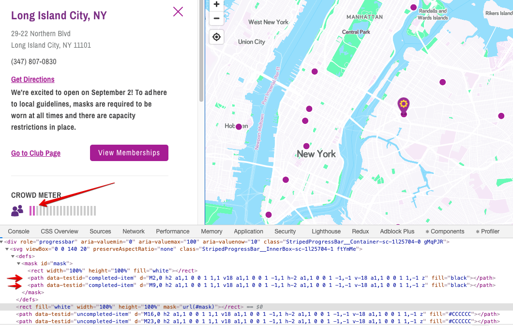
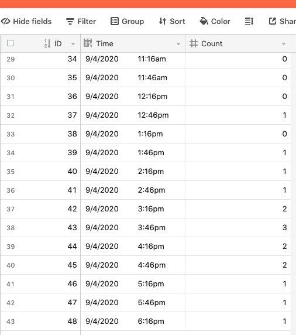
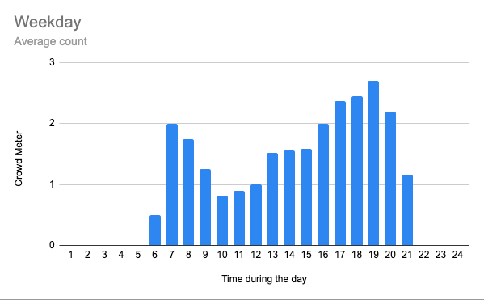

## Problem Statement


My gym in NY has recently re-opened. As part of Covid measures, the gym website has a new "Crowd Meter" feature that allows members to monitor gym capacity in real time.  

My goal is to **find the least crowded times to go gym** to reduce exposure risk.

## Approach

To do that, I need to collect data of Crowd Meter over regular interval across a few weeks.

Since there is **no open API** for the data, I will have to build a web scraper.

There are 3 parts to this:

1. scraping using Puppeteer and NodeJS
2. storing the scraped data somewhere (AirTable)
3. keeping the scraper running when gym is open


## Execution

### 1) Scraping

Traditionally, web scraping involves sending a GET request to a target website and parsing the returned HTML content. This works well if we want to grab static content e.g. from Wikipedia.

But we need a different solution here because the Crowd Meter part of the website is a **dynamically generated content**, i.e. it is not in the original HTML when we access our site. 

Instead, we use **Puppeteer**, a library released by Google Chrome team for headless browser scripting. It allows us to use code to **emulate human browsing activities** on a web application e.g. clicking, logging in, scrolling. 

#### Setup

```js
// create our NodeJS script file
touch script.js

// create package.json 
npm init -y

//  install Puppeteer 
npm i puppeteer

//  run script later
node script.js
```

#### Selecting our data

Getting the Crowd Meter data is a little tricky because the data is **not a number** which we can grab directly. Instead, it is represented as **a group of bar images**.

After inspecting the elements with Chrome DevTools, I found that the purple and white bars are nested separately, and we just need to count the number of *path* elements where the purple bars are nested. 



#### Script

```js
const puppeteer = require('puppeteer');

(async () => {
  // launching headless browser and new page
  const browser = await puppeteer.launch()
  const page = await browser.newPage()
  // go to our URL
  await page.goto('https://www.planetfitness.com/gyms/?q=11101')
  // click on "More details"  
  await page.click('.CardActions__MoreDetails-afujec-1')
  // wait 3 sec for content to be updated  
  await page.waitFor(3000)

  // counting number of purple bars
  const pathCount = await page.$$eval('svg > defs > mask > path', path => path.length);

  console.log(pathCount)

  browser.close()
})()
```

### 2) Storing scraped data

I've heard good things about AirTable and decided to give it a try. Think of AirTable as an **excel that works as a cloud database**.

After defining your schema on AirTable, you need to install airtable package in your scraper project.

One cool thing about AirTable is that it has a personalised API documentation with code sample pre-filled with your data schema.

#### Script

```js
const Airtable = require('airtable');
const base = new Airtable({apiKey: 'YOUR-API-KEY'}).base('YOUR-BASE-ID');

...

const pathCount = await page.$$eval('svg > defs > mask > path', path => path.length);

await base('Table 1').create([
  {
    "fields": {
      "Count": pathCount
    }
  },
], function(err, records) {
  if (err) {
    console.error(err);
    return;
  }
  records.forEach(function (record) {
    console.log(record.getId());
  });
});
```

### 3) Keep it running

The last piece of the puzzle is to keep the script running and scraping on a regular interval.

One approach is to deploy the script somewhere and hook it up with a cloud function that executes the script regularly. But that seems like an overkill for our purpose. 

Since the gym opening hour is almost the same as my daily hour using my laptop, I decided to just run the script on my **local machine**. I will run the script when I wake up, and stop it when I have dinner.

Adding the script below - using setInterval API in NodeJS - to execute the scrapping every 30 minutes.

```js
const checkMeter = async () => {
  ...
}

// check every 30 min
setInterval(checkMeter, 1800000);
``` 


## Result

Building scraper is the easy part; going to gym consistently is the hard part. Here are the result of this investigation.

#### Scraped data on AirTable



#### Result

This is calculated using data across 3 weeks.



#### final code

```js
const puppeteer = require('puppeteer');
const Airtable = require('airtable');
const base = new Airtable({apiKey: 'YOUR-API-KEY'}).base('YOUR-BASE');

const checkMeter = async () => {
  const browser = await puppeteer.launch()
  const page = await browser.newPage()
  await page.goto('https://www.planetfitness.com/gyms/?q=11101')
  await page.click('.CardActions__MoreDetails-afujec-1')
  await page.waitFor(3000)

  const pathCount = await page.$$eval('svg > defs > mask > path', path => path.length);

  await base('Table 1').create([
    {
      "fields": {
        "Count": pathCount
      }
    },
  ], function(err, records) {
    if (err) {
      console.error(err);
      return;
    }
    records.forEach(function (record) {
      console.log(record.getId());
    });
  });

  console.log(pathCount)

  browser.close()
}

setInterval(checkMeter, 1800000);

```


