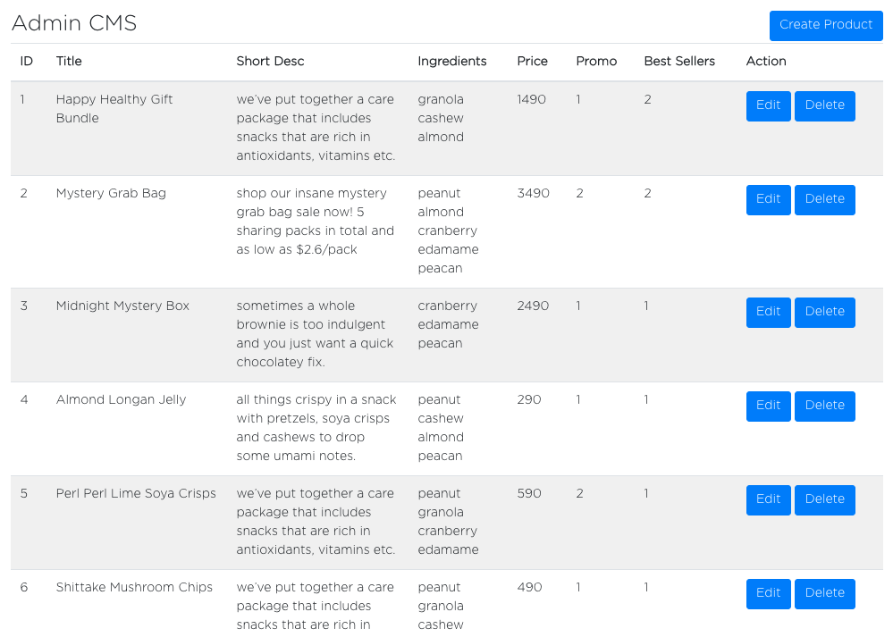
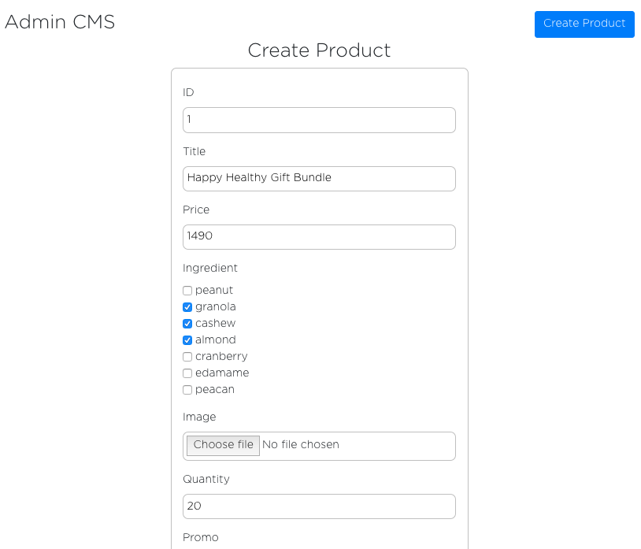
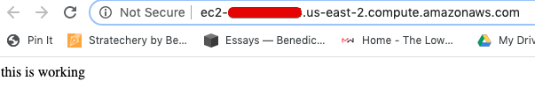
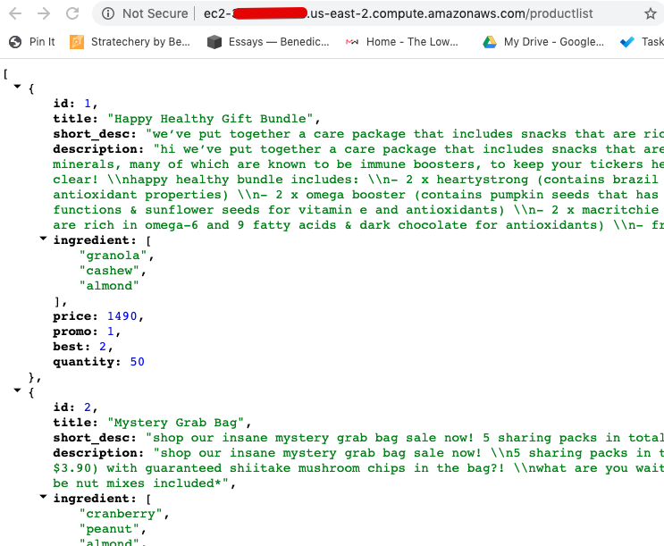

<p style={{fontSize: "0.7em", fontStyle: "italic"}}>Photo by Taylor Vick on Unsplash</p>

<br />

As part of the learning-to-code series, I wanted to get my hands dirty on **backend**.

So I decided to build REST APIs for my e-commerce project and deploy them to AWS.

Table of Content:

1. <a href="#background">Background</a>
2. <a href="#part-1">Building Node server and Database</a>
3. <a href="#part-2">Deploying to AWS</a>
4. <a href="#after">After thoughts</a>

...

<h2 id="background">Background</h2>

My deployment experience up to this point has mainly been on Heroku and Firebase - very simple and idiot-proof platforms. 

AWS is a whole different beast. It is known to be painful and have steep learning curve for beginners. So as a masochist, this should be fun.

...

Our test project is an <a href="http://boxgreen.web.app/">e-commerce</a> site replicating my friend's site. Read <Link to="/learning-to-code-finally/">here</Link> on how the frontend is built if interested.

User stories:

1. Admin is able to CRUD (create, read, update, delete) products 
2. App is able to fetch product list from our cloud database - previously, all products are pulled from a local json file.

Here's an overview of what this entails:

1. create a node server application that serves different endpoints for product CRUD
2. create a PostgreSQL database
3. create an admin interface that integrates the CRUD endpoints
4. deploy server application to AWS and connect to RDS (for production database)

...

<h2 id="part-1">Part 1 - Node server and PostgreSQL</h2>

<h4>1) Setup Node server</h4>

Create a server project folder, and run *npm init -y*

Install packages: nodemon, express, body-parse.

Create a server.js file.

In package.json, change script to:  *"start": "nodemon server.js"*, then *npm start* to start listening to your dev server.

Test to see our node setup is working:
```js
const express = require('express');
const bodyParser = require('body-parser');

const app = express();
app.use(bodyParser.json());

app.get("/", (req,res) => {
	res.send('this is working');    // check on browser http://localhost:3000


app.listen(3000, ()=> {
	console.log('app is running on port 3000');   // see on Terminal
});
```
<br />

<h4>2) Create local DB</h4>

brew install postgresql <br />
brew services start postgresql <br />
createdb "boxgreen-db";

I use Dbeaver for my GUI database tool, alternatively you can install psql and use command line as well.

Create a "products" table:
```sql
CREATE TABLE products (id int primary key, title VARCHAR(100) not null, short_desc text not null, description text not null, ingredient text ARRAY, price int not null, promo int not NULL, best int not NULL, quantity int not NULL);
// remember ; at the end
```
<br />

Test creating item in "products" table:	
```sql
INSERT INTO products (id, title, short_desc, description, ingredient, price, promo, best, quantity) values (1, 'Test Product', 'short description', 'very long description', array['peanut', 'almond'], 1099, 2, 1, 50);
// use single quote '' only
```

<br />

<h4>3) Connecting our node application to DB</h4>

npm install knex pg cors

We are using Knex as our SQL builder, but you can do without it as well.

```js
// connect to local db in our server.js file:
const db = knex({
  client: 'pg',
  connection: {
    host : '127.0.0.1',   // this means local host
    user : 'yinhow', 
    password : '',
    database : 'boxgreen-db'  	
  }
});
```

<h4>4)  Start building our API and routes</h4>

Our APIs:

```js
app.get("/", (req,res) => {
	res.send('this is working'); 
})

app.get("/productlist", (req, res) => {
	productList.handleProductListGet(req, res, db)
})

// isAdmin is a middleware we created to protect the route for admins only
app.put("/productupdate", isAdmin, (req, res) => { 
	productUpdate.handleProductUpdate(req, res, db)
}) 

app.post("/productcreate", isAdmin, (req, res) => {
	productUpdate.handleProductCreate(req, res, db)
})

app.delete("/productdelete", isAdmin, (req, res) => {
	productUpdate.handleProductDelete(req, res, db)
})
```

<br />

Example product update function:

```js
const handleProductUpdate = async (req, res, db) => {
	const { id, title, short_desc, description, ingredient, price, promo, best, quantity } = req.body.product;

	if (!id || !title) {
		return res.status(400).json("id and title cannot be blank");
	}		

	try {
		await db('products')
		.where('id', '=', id)
		.update({
			title: title,
			short_desc: short_desc,
			description: description,
			ingredient: ingredient,
			price: price,
			promo: promo,
			best: best,
			quantity: quantity
		})
		return res.status(200).send({message: "product update success!!"})

	} catch {
		return res.status(400).send({message: "Error: Unable to update product"})
	}
}
```

< br />

<h4>5)  Integrating APIs to frontend</h4>

With the above, we can start testing our different routes.

Before that, we built a simple admin CMS:





Then we create functions on our frontend to call our APIs:

```jsx
// function to call /productcreate API
const adminCreateProduct = (product, user) => {
	fetch(END_POINT + '/productcreate', {
		method: 'post',
		headers: {
			'Content-Type': 'application/json',
			'Authorization': user
		},
		body: JSON.stringify({
			product: product
		})
	})
	.then(res => res.json())
	.then(data => alert(data.message))
	.catch(err => alert(err.message))
}
```
<br />

Everything works so far for our development environment. We are fetching products from API and admin can CRUD products.

<h2 id="part-2">Part 2 - AWS</h2>

Initially, I was considering between AWS, Heroku, and Google Cloud/Firebase.

- AWS's free-tier is only for the first year of usage
- Heroku is free forever for hobby usage, but the dyno goes to sleep after 30 minutes of inactivity. Waking up takes 5-10 seconds.
- GCP has generous starting credit that should last more than a year

But ultimately, I went with AWS, since it is the more painful option and allows me to learn more.

...

There are two main ways to deploy to AWS:

1. use Elastic Beanstalk (EB)
2. deploy directly to EC2 and RDS

After talking to my mentor (hello Vinny!), it seems that for my learning's sake, I should try doing *without* EB so I can get exposure to the deep ends of things.

<h4>0) Create AWS account</h4>
Even if you're using free-tier, you need to put your credit card in.

<h4>1) Create RDS on AWS dashboard</h4>

AWS RDS is where we can set up relational Database like MySQL and PostgreSQL. 

For non-relational database, use AWS DynamoDB instead.

The initial setup is pretty straight forward. Remember your database name, and your database master/password.

<h4>2) Create EC2 on AWS dashboard</h4>

Two main things to note:

1. configure your security rules. for testing, I make it as relaxed as possible
2. download .pem file

<h4>3) Back to RDS</h4>

To ensure your EC2 instance has access to your RDS database, configure your inbound/outbound security rules.


<h4>4) SSH into your EC2 instance</h4>

SSH means connecting to the remote server from your own computer. It gives us access to the instance so that we can install, configure, and execute programs in the instance. 

EC2-endpoint:  In your EC2 instance dashboard, get the IPv4 Public IP under description.

RDS-endpoint:  In your RDS instance dashboard, get the Endpoint in the Connectivity & security section.

In terminal, to begin SSH:
```
chmod 600 boxgreen.pem  (if same folder)
ssh -i boxgreen.pem ec2-user@<EC2-endpoint>
```
<br />

With an active SSH session connected to your EC2, you can now connect to your RDS instance where our database is at:

```
sudo yum install -y postgresql

export PGHOST=<RDS-endpoint>

psql --user=<user> --password <database-name>
// this will then prompt for your database master password (not your AWS password)
// <user> is your database master user name

CREATE USER admin WITH ENCRYPTED PASSWORD 'somepassword';
GRANT ALL PRIVILEGES ON DATABASE boxgreen TO admin;
ALTER DATABASE "boxgreen" SET bytea_output = 'escape';
```
<br />

Note: in our server.js file, remember to change our DB connection to production:

```js
const db = knex({
  client: 'pg',
  connection: PRODUCTION_CONNECTION
});

const PRODUCTION_CONNECTION = {
  	host: 'boxgreen-db.blablabla.us-east-2.rds.amazonaws.com', // your RDS end-point
  	port: '5432',
  	user: 'yinhowlew', //database admin
  	password: '...', //database password
  	database: 'boxgreen'	
}
```

<br />

Then, create your database table for products:
```
CREATE TABLE products (id int primary key, title...)
```


<h4>5) Installing Node on your EC2</h4>

When we get an ec2 instance, think of it as we are getting a brand new computer somewhere that hosts / executes your files.

That means we need to install any programs/packages we need to run our code.

In our case, we need Node Version Manager (NVM) which helps install/manage Node.

in your terminal (make sure you are still SSH in):
```
curl -o- https://raw.githubusercontent.com/nvm-sh/nvm/v0.34.0/install.sh | bash
. ~/.nvm/nvm.sh
nvm install 12.16.3   //the Node version i want
// to check that it's installed: 
node -e "console.log('Running Node.js ' + process.version)"
```
<br />

Some [documentation](https://docs.aws.amazon.com/sdk-for-javascript/v2/developer-guide/setting-up-node-on-ec2-instance.html) from AWS if you are lost.


<h4>6) Deploying our source code</h4>

Install git on ec2:

```
sudo yum update -y
sudo yum install git -y
git --version // check that it's installed
git clone [the git url of your source code]
cd boxgreen-server //folder you downloaded
npm install //install dependencies
node server.js //run
```
<br />

go to our EC2 public IP in browser, and <p style={{"color": "red", "font-size": "36px", "margin": "auto"}}>VOILA!</p> I see the most beautiful words ever printed: "this is working", 



Checking our /productlist end-point to make sure it's not a fluke:


<br />

We now have a ready production API that our frontend app can integrate!

**Troubleshoot:**
If it doesn't show at first, check your security rules. It took me some tinkering of security rules to get this working. 


<h4>7) installing pm2</h4>

For now, our node app is running because we SSH in from our terminal to run it.

To keep node app running on ec2 even after we disconnect, we need to install pm2.

```
// make sure you are SSH in so you're installing on EC2 and not your own machine!!
npm install pm2 -g  
pm2 start server.js
pm2 startup (so that it starts if server restarts, then follow instruction in command line)
```

<h4>8) Trying Elastic Beanstalk</h4>

Still buzzing from the high from successful deployment to EC2 and RDS, I decided to try out Elastic Beanstalk (EB).

EB is an easier way to manage and deploy different moving parts in our AWS setup. My friend Colin has written an excellent [series](https://colintoh.com/blog/aws-elastic-beanstalk-survival-guide-introduction) on this.

To start, install [AWS CLI](https://docs.aws.amazon.com/cli/latest/userguide/cli-chap-install.html) and install EB CLI (brew install awsebcli).

For EB CLI installation, you need to get Access Key ID and Secret Access Key from your AWS profile.

The main commands you need:
- eb init
- eb create (I didn't use AWS codecommit)
- to deploy, git add and git commit, then eb deploy

...

There were 2 main issues I faced:

1)

When I first deployed to EB, EB created a new separate EC2 instance.

So I had to configure security rules for the new EC2 and our RDS accordingly.

I wonder if we can move already-created EC2 instance to a EB environment.

2)

On the first few deploys, our server health was **severe/degraded**. And the end point was not working.

This took me half a day of trial-and-errors, removing/creating new EB environments, thinking it was configuration issue.

Eventually, I digged up the server log, and found that the server could not even start, and that our config file (that houses our DB credentials) couldn't be read.

Turned out it was because we used **gitignore** to exclude our config file from uploading to our repo. So our server files deployed to EB did not have config file.

Lesson learned: start reading server log early to figure out a problem

...

Once we ironed out these two issues, our deployment on EB works.


<h2 id="after">Afterthoughts</h2>

Going in, I had *some* nodejs and postgresql experience, so that part was pretty smooth.

But for AWS, I was absolutely going in **blind** and winging it along the way. 

Because of the pace of development/change in AWS, a lot of tutorials in Medium and even documentations by AWS are semi-outdated. 

So I was juggling 6-7 articles at one time and piecing together different relevant information. 

Along the way, my thoughts were oscillating between "I have no idea why but this works" and "wtf why is this not working".

...

Six months ago, I didn't imagine I will be using SSH or going through server log.

Before this, deployment and server often seems like an intimidating **black-box** process to me.

There's this fear that if you make one minor misstep and you'll see *404 Not Found nginx* text on your screen that leaves you scratching your head.

Going through and unpacking this process - confronting this fear and trying to understand the rationale behind each step in the process - helps me in realizing that computer systems and tools are all man-made, and that **even the most complex tools can be learned and mastered with enough time and care.**

...

P.S. The **high** I felt after the Voila moment is right up there alongside my other highs in recent years: making the first sales, closing the first investment, winning poker, achieving team profit, etc. It's rather addictive.


