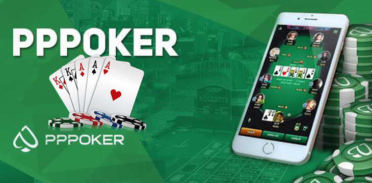

Building a product is tedious, and knowing what to build is even harder. But the **biggest hurdle** for most early founders is not in building, but in distributing and marketing your product.

Here are two new companies you might not have heard of - winning market share, *not* by being the first, *not* by having the best product, but by **having the best distribution strategy**. 

## Relx

Relx (NYSE: RLX) is a China-based e-cigarette company that is dominating the market in China and the rest of Asia. 

Founded in 2017 by former Uber and Huawei executives, Relx is a **very late comer in a competitive industry** - fighting not just other e-cigarette players, but also the entrenched tobacco industy and government regulatory bodies. But their international market doubled every year, and they went public in New York Stock Exchange earlier this year. 

How did Relx stand out in such a crowded space and become regional market winner in such a short time?

Just as many other modern competitors, Relx employed a wide range of influencer marketing and other mainstream digital ads. But what propelled its international growth is their **agent / dealership channel** where Relx works with country resellers and individual agents to distribute their products. This is particularly effective for a few reasons:

1. It lowers the **investment cost needed to penetrate a new market** - establishing local entity, navigating different regulatory environment, figuring marketing and distribution channel of each particular country. Instead, Relx sells directly to local agents, counting on their local know-hows and varied forms of distribution to indirectly get Relx into the hands of new customers. 

2. While e-cigarette is not new in general, there is still a great deal of market education needed in Asia. Agents know local markets and their customers the best, and can help educate the market on the ground, without Relx having to invest in **market education**.

3. Most jurisdictions have **banned advertising** on e-cigarette. So the quickest way to gain market share aggressively is to get individual agents to promote on their social networks. Typically, customers buy from agents through WeChat / WhatsApp / Telegram / FB Messenger with cash on delivery. It is a particularly attractive proposition for the agents, because majority of the purchases are turned into recurring revenue - customers need to periodically buy pods, the refillable part of e-cigarette. And most agents offer referral scheme that incentivizes you to refer your other smoker friends to Relx, which achieves a strong word-of-mouth marketing effect.

It is interesting to note the different distribution strategy of Relx and Juul, the dominant brand in U.S. 

**Juul** was not able to get much traction initially despite multiple iterations of marketing and launch strategy. The product finally got into its stride after getting into convenience and grocery stores around the country - the good old retail distribution method.

## PPPoker

PPPoker is a club-based poker app.

In mainstream online poker, the company operating the software is the **house** - handling cash transactions, and running games directly for players, profiting from taking rakes/commissions. As a player, you can join, deposit money, and start playing.

PPPoker, on the other hand, does not run games directly. It serves a **B2B2C model** where it provides the tools for individual club hosts to organize their own games with their own set of players. Most of the revenue of PPPoker comes from selling in-game poker chips to club hosts, and partly from selling virtual currencies for players that are used for in-game emojis and other inconsequential user experience. 

To play in PPPoker, you need to know club hosts and be invited. Clubs are siloed and run like micro independent casinos - each with its own player pool, rake structure, game variation, and offline cash settlement standard. 

Even though PPPoker is rather late in the online poker world, and definitely does not have the best product in terms of features, it has an explosive global growth in the past five years, largely thanks to its **clubs/agents model of distribution**. 

A few smart things about this setup and distribution strategy:

1. PPPoker **abstracts itself from the operational and cashflow management issues** that come with directly running a poker software. It also does not need to worry about navigating the murky water of legal and regulatory issues in different jurisdictions. Officially, they are a mobile app that allows people to play poker privately with friends - which is why the app is public on App Store and Google Play with no issue.

2. Most club hosts have been organizing games in person, and have deep roots in poker communities and ready pools of clientele. PPPoker offers a way for these club hosts to **multiply their earnings** by organizing games online - which can run 24/7 without the limit of location and manpower. In this way, **club hosts have the financial incentives to promote PPPoker** to their customers and grow the club.

3. This allows PPPoker, with its limited resources as a new comer, to **focus on one thing only - getting club owners onboard**. This involves a lot of ground work, going to each market, understanding each poker community and its influencers, getting proxies to infiltrate underground poker games, slowly extending its reach through the intricate poker networks and bringing in club hosts.

## Final Remarks

Both Relx and PPPoker are late comers in very competitive and crowded industries. They might not have the best products or prices, but they understand their **winning condition** - distribution. In this case, distributing on the ground - through an army of agents and hosts who are financially motivated to promote your product - and executing this strategy to perfection.

