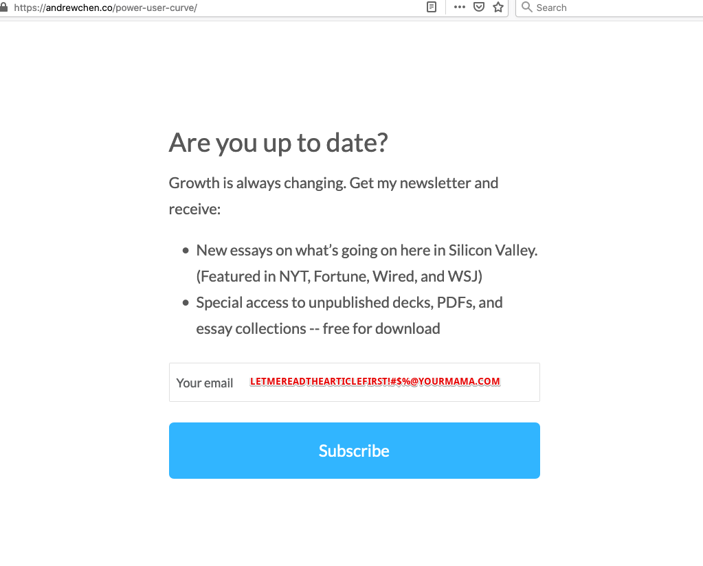
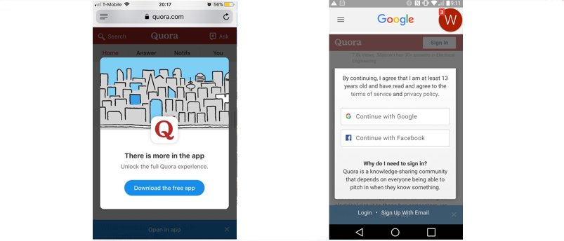

Image from searchengineland.com

I get pissed off when I come across a product with bad UX. 

So this is a memo to all Product Managers, UX Designers, Engineers, and Marketers out there: **don't do Dumb Hacking**.

...

Growth Hacking is a general approach to help fuel the growth of a product, spanning the entire funnel of customer acquisition, conversion, and retention. 

When done well, it brings together a beautiful synergy between marketing, design, analytics, and engineering and gets your product into hands of happy users.

When done poorly, it becomes Dumb Hacking and pisses off your users.

Here are some examples:

<h4>1) &#x274C; dumb hacking - forcing you to subscribe to newsletter before you can read an article</h4>

screenshot: blog from a prominent VC

This is akin to forcing a customer to sign up to be a member **before customer even steps foot in your store** and sees what you are selling.

In Product Management term, this is called blocking users in their **critical path**, which is a big no-no.

If I don't even know what value I can get from your site, most of the times I would just put in a fake email. 

In the example above, dumb hacking succeeded in getting 1 more fake user (*letmereadfirst @ yourmama.com*).

&#x2705; growth hacking - instead, allow users to explore and make your value proposition so compelling that they want to voluntarily signup

 

<h4>2) &#x274C; dumb hacking - making it difficult to unsubscribe</h4>

Some terribe UX when user clicks on "1-click unsubscribe":

- user is forced to sign in
- "Did you unsubscribe by mistake" - no, I did not click on a tiny link at the end of email by mistake
- "**I am okay with not saving money!**” or “I don’t like to learn.” - don't be condescending to users
- not a real unsubscribe. User gets unsubscribed from just 1 type of email marketing and still subscribed to 10 more types of emails
- user is led to a page with many checkboxes and options

When users have difficulty unsubscribing, they will just resort to reporting the email as spam, which ends up hurting your business. 

&#x2705; growth hacking 

- respect user's attention, send better emails. 
- make it easy for user to adjust frequency and type of emails received.
- respect user's intention to leave

 

<h4>3)	&#x274C; dumb hacking - making it difficult to cancel an account</h4>

Some genius decided that if we don't show option to user to cancel an account, user will continue to be a customer.

If you allow user to sign up easily online, yet forces user to call in to cancel an account, you are an asshole business. 

&#x2705; growth hacking - respect user's intention. Offer a last-ditch discount/promo to change user's mind.

 

<h4>4) &#x274C; dumb hacking:  browser notification pop-up on page load</h4>

credit: https://stephaniewalter.design/

One of the biggest collective waste of time for humanity is clicking "no" on these annoying browser notification permission.

Do not demand permission on page-load.

&#x2705; growth hacking: again, make your value proposition so compelling to user that user wants to get browser notification.

 

<h4>5) &#x274C; dumb hacking:  forcing users to signup for no apparent benefit to users</h4>

If the only reason you need a user to signup is to collect email and data, you need to re-consider your business.

&#x2705; growth hacking:  demonstrate clear incentive and value of signing up to users that they will want to sign up.

 

<h4>6) &#x274C; dumb: forcing user to download and use app instead of accessing from mobile web </h4>

Sometimes the app experience is superior and we would want users to use app instead of mobile web.

But this is not always the case.

Most of the times, it is just business thinking: "we invested in apps, we should get users to use it instead of web. Lets get these sweet DAU and MAU **vanity engagement metrics** up for our mobile apps."

If user can quickly get what they need on mobile web, there is no reason to force users to download app.

E.g. if I need to buy a wine, I should not need to download an app to do that.

&#x2705; growth hacking: 
- Instagram allows users to navigate a few pages on mobile web before asking users to switch to app and clearly explaining why app experience is better for users.
- **Differentiate the product focus** of your web and mobile app - web is for general usage, and app is for loyal hardcore users who loves your business enough to download an app.

...

<h4>Parting words</h4>

Great growth comes from making a product that makes marketing easy. A product worth growing. A product people will keep coming back and tell their friends about it.

Don't do dumb hacking.

Don't insist or demand users to pay attention by blocking their critical path.

Invest in customer service instead of A/B testing your button colors.

Be obsessed over delivering value to users, rather than over optimising vanity engagement metrics.

Retaining and building trust with customers takes time and effort. But **pissing off users takes just 1 second**.

