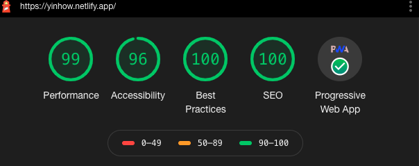

Photo by Marvin Meyer on Unsplash

This blog is built with Gatsby and served with Netlify.

Gatsby is a modern web framework built on React. It is known for building "blazing fast" sites.

It is part of the JAMstack technologies, along with Netlify. If you'd like more explanations on JAMstack, please read my other post <Link to="/jamstack">here</Link>.

<h3>overall experience</h3>

 

JAMstack delivers as promised. The site is indeed blazing fast.

The development process is fairly intuitive and painless even for a beginner like me. Gatsby has a very good tutorial and documentation, and Netlify is so easy-to-use that I  only spent 10 minutes on it and everything worked like magic.

How Gatsby fares against Wordpress (both .com and .org):
- delivery is much better optimised, and page loads are blazing fast
- developer experience is superior. WP often feels clunky and bloated
- plugins are a source of joy in Gatsby (for now), but a source of hell in WP
- writer experience wise, you have much better control, can add components and code blocks easily, though if you just need to write simple posts, WP is easy to use

How Gatsby fares against Medium:
- they are not exact apple-to-apple comparisons, since Medium is more of a publishing platform.
- Medium is optimised for great writing experience where you don't have to worry about config and maintaining. If you are part of a great publication, you will have easy distribution and access to your writing. 
- But ultimately, you don't own your content (and audience) on Medium. And you don't have a say in the general user experience of your site.
- Medium is great for work-related writings. But if you want to write on more eclectic topics like me, running your own Gatsby blog is a better fit.

 

<h3>implementation details</h3>

 

**Components**

Gatsby uses React, so you'll write / import / export your components just as a standard React project. The only difference is any React component put in src/pages/ folder will automatically become a page.

**Writing**

I use Mdx (a type of markdown file) for my post writing. It is intuitive to write, gives great writer control, and supports code blocks as well as embeds any React component you wrote.

Alternatively, you can hookup Gatsby with any Headless CMS or external data source e.g. Wordpress, Netlify CMS, Contentful, Prismic, etc. If you are building this for someone who needs WYSIWYG editor interface, Headless CMS might be easier than Mdx.

At the top of your mdx post, you can add a frontmatter section to create the title, description, date, tags, featured image, etc.

For adding code block / syntax highlight, you can use prism-react-renderer with Mdx.

**Plugins and Config**

Gatsby has a suite of APIs and plugins you can use, e.g. reading mdx and file system,  tranforming into responsive images, GraphQL queries, etc.

E.g. gatsby-image optimises and re-sizes image files, and lazy-loads your images with a cool blur-up effect so that your initial page loads are much faster.

You'll also use Gatsby Node APIs in a Node helper file (gatsby-node.js) to create nodes and pages (and slugs) dynamically. 

E.g. the createPages API helps turn your mdx file into a page component using a template component you wrote.

**Data Layer and GraphQL**

Gatsby's data layer is powered by GraphQL. GraphQL is used to enable components to declare the data they need, and "pull" / load data into react components. Basically, if a page need any data, you need to write GraphQL query, which will be executed at build-time.

You can use GraphiQL - an IDE that comes with Gatsby - to help structure your queries correctly and also check if your node functions work.

**Themes**

Gatsby offers themes that you can use off-the-shelf like Wordpress. But if you prefer the control and satisfaction of building things from scratch, you should use the Gatsby Starter files instead.

**Styling**

Since I'm design-challenged, I use typography.js to generate base styles, coupled with just vanilla CSS. Some prominent Gatsby blogs use CSS-in-JS such as styled-component, but I haven't gotten around to learning it yet.

For dark/light mode implementation, I use Dan Abramov's code.

**SEO and PWA**

Gatsby has a React Helmet plugin that helps populate document head with metadata that helps with SEO. There are also plugins that add service worker and manifest to be PWA-compliant.

When you run a Lighthouse audit on Chrome, you'll see the site has excellent scores (100/100) for SEO and PWA.

**Performance**

>"Gatsby utilizes the power of code/data splitting, pre-loading, pre-caching, image optimization, and all sorts of performance enhancements" - Tania Rascia

Your site will likely score close to 100/100 in performance in Lighthouse audit. Mine is not yet 100, but close; probably needs to optimise my code more.

**Hosting**

Hosting and building is done on Netlify. And it's free for my usage.

You can connect to github for continuous deployment. Each time you push to github, Netlify will build your app and auto-deploy it to its CDN. It's really neat.

Netlify also offers serverless functions if you need some backend capabilities.

