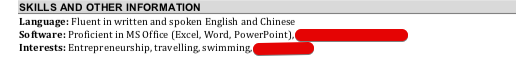
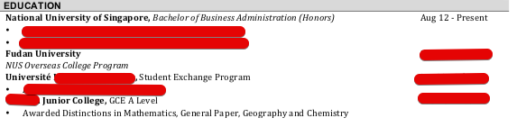

Photo by Drew Hays on Unsplash

Finding our dream job - one that fits our <Link to="/ikigai">ikigai</Link> - is one of the few most important decisions we can make. 

Most of our adult waking hours are spent in work.  Nothing is more miserable than feeling trapped, under-appreciated, and alienated in jobs and companies that we don't like.

..

In my previous companies, I have read hundreds of resumes and interviewed close to a hundred of applicants.

Here are some perspectives you might find helpful.

..

<h3>1 - CV / Resume</h3>

  

I usually spent only **a few seconds** to skim through a CV before discarding it or bookmarking it for deeper scrutiny.

That means, within a few seconds, you need to be able to grab attention and tell your story clearly.

<h4>Story</h4>

 

Tell a focused and coherent story.

Humans have a tendency to categorise and box things into "labels" - make sure you give them the labels clearly and strongly.

If you are an engineer, you want your CV to convey:

- experienced engineer
- has built large-scale modern application
- always learning new technologies

If you are in sales, you want these labels to come across immediately:

- proven sales record
- understand our industry

...

<h4>Less is More</h4>

 

Focus on the 2 most relevant and important experience. Don't clutter your CV with things just because it might look good.

If you have 5 years of working experience, don't include your 3 month internships during your university days.

If you are a designer or developer, pick your 2 best projects in your portfolio, instead of a list of 10 small projects.

...

<h4>Summary / Highlights section</h4>

 

Some people add a summary section at the top of CV.

Most of these summaries are generic and a waste of attention and space.

You should only consider adding it to tie up your story if your background is non-standard. 

And if you do, try not to write more than 2 sentences.

Don't:   

- "to utilise my skill set and passion to help company achieve objective"
- "goal-oriented, highly motivated, good leadership skill"

Do (maybe): 

- "experienced ReactJS advocate, seeking to help elevate the engineering team"
- "the sales guy you need - looking to help grow my next company 10x"
- add humor and personality: "reading beautiful code makes me awake without coffee"

...

<h4>Interest</h4>

 

Don't do this

 

Don't list common interests such as traveling, photography, or cooking, unless you have a cooking youtube channel or a photography blog.

If you are a part-time DJ, or a national poker champion (heh), by all means include these.

Ignore adding interests if there's nothing outstanding or if it doesn't fit your story.

Also, you don't need to add "languages" unless this is relevant to the job. Who cares if you have taken one year of Italian.

If you add Microsoft Office as your skills, god bless you.

...

<h4>School/Education</h4>

 

Don't list 4 schools

 

I honestly don't care about this, unless you went to the top schools in your field.

List only your latest school, unless your high school is a strong signifer (e.g. Raffles / Hwa Chong in Singapore).

Also, don't care about your "relevant coursework", "co-curricular activities" or "community service" at school. Unless it is unique or relevant to your story.

Does knowing that you are "Vice President of XXX University Music Club" helps?

Instead, focus more on what self-initiatives you have been taking, **outside the normal schooling track**, to learn and grow. 

...

<h4>Skills Rating</h4>

 

Don't do this

 

Some candidates has a "skills" rating section.

Please don't do that.

Trust me, nothing good will come out of this. 

Whoever invented this did a disservice to mankind.

 

<h3>2 - Hunger / Indication of Interest (IOI)</h3>

 

If a candidate doesn't understand my company well, either through a **cookie-cutter Cover Letter** or failing basic question during interview, the candidate will be rejected immediately.

It shows a lack of hunger and interest in the role.

This seems like common sense, but a good 30% of candidates I've encountered failed even a simple "what do you know about my company" question.

...

A few things you can do to convey strong IOI and an insatiable hunger:

1. if the company has a product, make sure you sign up and use the product. Share your analysis and thought process either in Cover Letter or during interview.

2. do some work to show you're ready to hit the ground running. Some real-life examples I've seen:
   - came up with a marketing strategy and user acquisition plan when applying for a marketing role.
   - designed, built, and demo-ed an app to show his understanding of app development when applying for a technical project manager role. Needless to say, this guy went on to be an absolute rockstar in the company history.
   - wrote an email to startup CEO with a business plan - with market analysis, user pain points, competitive landscape, etc - for a role in said startup. I did this and got in.

3. if you are making career/industry switch, make extra effort to explain the "why", elaborate your interest/passion in the new industry, and show how your different experience and perspective is valuable.

...

It is true that for some, your stellar credential and CV speaks for itself.

But for most people, this is the best way to make yourself stand-out and show your character.

 

<h3>3 - Interview</h3>

 

I usually made up my mind within the **first 5 minutes** of interview.

The rest of the 30-40 minutes of interview is merely for the candidate to prove me wrong - but more often than not, my initial assessment stood.

My methodology might not be systematic or scientific, but I suspect most hiring bosses share the same intuitive approach.

SoftBank CEO Masayoshi Son famously invested in Jack Ma's Alibaba before they had any revenue, partly because "his eyes were very strong", i.e. Jack Ma's force of personality. *The same approach might have led him to the fiasco of WeWork's Adam Neumann, but that is another story.*

...

Usually, if a candidate made it to the interview round, he/she usually has the requisite hard skills/knowledge for the role. Thus, the in-person interview is more to judge a candidate's soft skills and fit.

These are what go through my mind during interviews:

- will I enjoy working with this person
- culture fit: can this person work well with people in the company
- attitude: is this person hungry and willing to learn
- how does this person deal with failures and mistakes, or react when things go rough
- is this person personable and likeable, someone human and relatable
- thinking: does this person listen well, and does his/her answers show coherent and mature thinking process
- passion: does his/her eyes lit up when talking about his/her proud achivement/project

 

<h3>4 - Asking questions as candidate</h3>

 

A good mental model to approach a job interview is to view it as a 2-sided affair - much like a dating process.

And that means asking good and earnest questions to learn more about the company and the job.

Don't:

- asking questions for the sake of asking
- asking questions to sound smart and coming across as smug

Some reasonable questions to ask:

- "What will my KPI look like in the first quarter and the first year?"
- "what does a star performer look like in this role?"
- "How does the growth path of this role look like?"
- "Who will I be working with and reporting to?"
- "How is the design/sales/engineering culture like here?" 
- "Where is the next growth frontier for the company?" *(note: this is not an easy question to pull off. ask this only if you have talked strategies with the CEO/top executives; don't just abruptly ask this to HR.)*

...

Asking good questions achieves a few things: 

Firstly, a job is a huge commitment. so you want to know what you're jumping into.

Secondly, it is a good indicator of interest from your part.

Also, people like talking about themselves, and companies are no different.

Lastly, it **levels the power dynamics**. When a company knows that you are not desperate, that you have standards, and that they are being evaluated, it subconsciously elevates your value in the company's eyes. Similar principles applies to dating.

There is a famous saying: "people don't leave bad jobs, they leave bad bosses". 

If possible, find out if your direct boss is interviewing you, and make sure you "interview" the boss too, since, well, you have standards and only want to work for someone great. 

 

<h3>5 - Junior vs Senior roles</h3>

 

There are common elements to evaluating both junior and senior roles - communicate well, motivated and driven, personable, dedicated, and having requisite skill set.

However, in more advanced roles, there are extra dimensions in the decision matrix:

- network  - when we hire this person, who is he/she bringing along (clients, employees, industry contacts etc). When we are marrying someone, we are also marrying the family.
- track record & referral - is there a history of excellence, does the candidate's past co-workers and clients have good things to say about him/her

For more junior position, since there is less track record, there is heavier emphasis on attitude.

 

<h3>6 - Likeability trumps intelligence</h3>

 

>"I want to hire this guy because he is smart" -  says no employer ever

In almost every job application, there is a final gatekeeper - a human person making the call whether to hire/reject.

For 2 candidates with equal qualification, if the gatekeeper likes you more, you will get in. The gatekeeper will be your internal champion, to promote your candidacy and push you through the door.

...

Unlike A.I., human beings have preferences, biases, and flaws. And almost universally, we have preference towards **likeability**.

What constitutes likeability?

If you have watched <a href="https://www.youtube.com/watch?v=WXuK6gekU1Y">AlphaGo documentary</a> - I highly recommend it, it's free on Youtube - the Chinese guy Fan Hui is an embodiment of likeability.

Someone with earnest passion.

Someone with vulnerability.

Someone we can identify with and root for as human.

He does not try too hard to please or be likeable. He's simply being himself and showing his character.

...

It is difficult to advise how to increase your likeability. But just know that if you let your personality shown, and if the company doesn't like what they see, that means the company is not a good fit for you anyway. 

