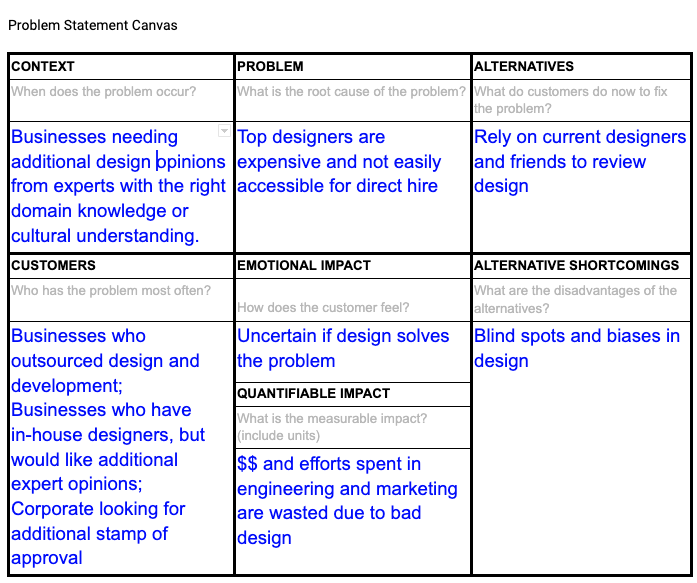

 

I'm launching a new platform called <a href="https://borrowmind.io">BorrowMind.io</a>. 

Currently in prototype phase, we help businesses get design reviews from top design experts. 

## How It Started

In the depth of Covid lockdown, I met a few like-minded folks through **virtual networking** on <a href="https://lunchclub.ai">Lunchclub.ai</a>. 

It is a cross-continental relationship, but we started working on small projects together and slowly built up the momentum to work on BorrowMind. 

... 

We began by trying to understand this problem space more intimately - **interviewing** product owners and designers, and conducting **survey** to entrepreneur communities.

What we found is: 
- 50% of business owners have considered getting external experts for design review, 
- 70% see value in it,  
- yet only 10% have engaged in one.

Those who see value in design review but have not engaged in one cited *"don't know where to find one"*, *"cumbersome process"*, and *"cost"* as the main blockers. 

## Multiple small launches

Instead of one big launch that takes 6 months to prepare, we decided to roll out **4 different phases of smaller launches**, each with its validation objectives and metrics.

In the first few phases, our only objective is find out **if the market demand is strong enough** - to successfully validate and move on to the next phase, we gave ourselves metrics e.g. X number of design reviews done, Y number of requests, etc.

For example if we get a lot of feedback that *"hey you don't have the right design experts for me"* or *"please improve your website and process"*, then at least we know we are on the right track and there is a problem to be solved. If most of the feedback are "cool, but I don't need this ever", then we will probably have to pivot and re-think.

For our closed Beta phase, we put up a prototype site and onboarded a few top designers in our circle, and started testing with a few businesses. Most of the communications and review work are done on email, outside the platform. We also made sure that the initial customers **paid** for the service - albeit at a discounted price - since the market signal and feedback we get from offering a free product will not be helpful. 

## Problem Overview

Typical software development has multiple processes and best practices to ensure quality delivery - from code review to hiring external experts such as security auditors, DevOps specialists, and architecture consultants.

Yet most companies do not have a similar level of rigour in their design process.

In most cases, key design decisions are made in a **black box**, between product owners and designers, sometimes with neither party having the right domain-specific product knowledge or cultural understanding.

What ends up happening sometimes is these companies ship a technically-solid product, but due to the lack of the right design expertise, the product has **design blindspots and deal breakers** that fail the product.

## There's no good solution currently

Top designers are expensive and often **unavailable** for direct hire or even a 3-month contract. They are working full-time in top companies, and can't be easily found on freelancer website.

If you happen to hire one on a short contract, there is a painful **process** to draft up contract and NDA, negotiate man-hours, manage scope and deliverable.

## Solution

Our hypothesis is there is value in borrowing the minds of experts in a clear and simple process - there's no need to negotiate rate or manage deliverable by experts, and we make it easy to get multiple reviews at a time. 

To makes the process simple and fuss-free, we offer 3 tiers of deliverables and pricings, ranging from a **90-minute Quick Review** to more in-depth full-day audit. 

We see this as a **complement to user testing** - there is no substitute to getting feedback from end users, but having perspectives from design experts might bring extra rigour to the design process.

Our value propositions for businesses:

1. uncover blindspot and biases in their products.

2. pick the brain of top designers who are otherwise unavailable or unaffordable for long-term direct hire

3. access to experts with the right domain knowledge e.g. FinTech in US, Social Network in Asia, B2B marketplace in Middle East

Our target customers:

1. Businesses who outsourced design and development, looking for design review

2. Businesses who have in-house designers, but would like additional expert validation

3. Corporate product team looking for stamp of approval to get business team to sign off

## Vision

The long-term vision for this product is to democratise access to the full spectrum of expertise a business and product would need to succeed, including marketing, SEO, growth hacking, tech architecture, software security, copywriting, legal.

## Where we are now

We have spent the past few months battle-testing the processes with a few paying customers, and have gotten great feedback so far.

We are currently in **prototype phase**, and are in the midst of onboarding more design experts, optimising our process, and building up the platform further. 

If you have any input on the product, or if you know any business owner or design expert who might be interested, please let me know!

