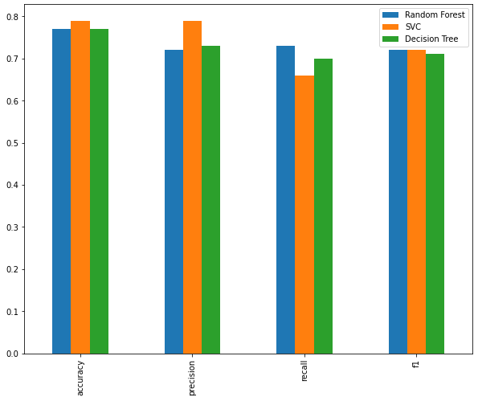

Photo by Liam Charmer on Unsplash

Did you know that we have been helping Google to train bots without realizing it?

Those annoying **"I'm not a robot"** <a href="https://www.techradar.com/news/captcha-if-you-can-how-youve-been-training-ai-for-years-without-realising-it">captcha</a> tests not only serve to distinguish us from bots, but also **helps train Google's A.I.** to recognise image better.

Did you notice these captcha has been showing more cars and roads images lately? When we have self-driving car, you should be proud that you help train it.

...

You told a client / your boss that you know Machine Learning (ML).

Now you need to get a high-level overview before your meeting tomorrow.

Here's your 10-minute guide.

Table of Content:

1. <a href="#background">Background</a>
2. <a href="#intro">ML Intro</a>
3. <a href="#process">ML Process Overview</a>
4. <a href="#after">Closing</a>

<h2 id="background">Background</h2>

ML used to be one of those buzzwords that my mind automatically filtered out. It finally got my interest when my friend Ben did an internal company sharing on ML.

I just finished a course and thought this might be a fun topic to write on.

This article will be the starting of a series:

1. ML 101
2. Classification with Scikit-learn example
3. Deep Learning with TensorFlow example

<h2 id="intro">Intro</h2>

Machine Learning is getting computers to perform a specific task without explicit instructions. 

What does it mean by "without explicit instructions"?

Traditionally, we get machines to perform a task by telling them **IF this THEN that**. But for very complex problem that we can't map out the exact steps, we will need machine to figure out the steps and instructions themselves. 

This is done by **training** machines, getting them to learn about different patterns in data using different algorithms and statistical models.

What does training entail?

For example, if we want our program to identify a dog breed from a dog image, we need to feed the program a large quantity of **training data** - dog images along with the correct labels / answers. 

Machine learns by an **iterative** process of minimising the loss function / cost function which denotes how much error machine makes in prediction. This is done through different optimisation algorithms such as gradient descent. 	

...

Training a machine from scratch can be very costly (time, computing power, and amount of training data). ML only became more mainstream in the past few years when we have a **massive increase in data** and advancement in CPU/**GPU** capabilities.

Some real-world applications of ML:

- personalised recommendation by YouTube, Netflix
- investment portfolio allocation by robo-advisor 
- content moderation: filtering spam mail, flagging offensive posts on social media 
  - a friend of mine works as a ML engineer at a social network, and his daily job consists of looking at porn and figuring out how to optimise their platform's porn flagging capability
- merchandise demand forecasting for Amazon
- facial recognition
- medical prognosis

Types of ML

 

1) Supervised Learning

- learns on labeled dataset - use X (data) to predict y (label)
- there is right or wrong answer
- subcategories include **Classification** (is this a spam), **Regression** (predicting housing price)
- according to Andrew Ng, most real-world applications of ML uses Supervised Learning

2) Unsupervised Learning

- learns on unlabeled dataset, i.e. there's no clear right/wrong answer
- subcategories includes Clustering, Association Rule Learning 
- e.g. Netflix **recommendation**, customer segmentation 

3) Transfer Learning

- instead of building a model from scratch which is costly, Transfer Learning adapts already-trained model from a similar problem space
- e.g. Tesla uses ResNet50 backbones from Pytorch Hub for their vehicle computer vision

4) Reinforcement Learning

- teaching machine through trial and error with rewards and punishments 
- machine learns from mistakes and maximizes towards an objective 
- e.g. AlphaGo - machine plays the game countless of times to improve win rate  

ML Methods/Techniques

 

**Deep Learning** - powered by Neural Networks - is a broad class of Machine Learning method that is great for complex and *unstructured data such as images, videos, audios. 

*Note that images, videos, audios do have internal structures, but they are not structured via pre-defined data models or schema.*

Compared to other ML techniques, Deep Learning often requires significantly more computing power, often cluster of super computers.

Their application includes: facial recognition, speech recognition, natural language processing (NLP), computer vision.

For **traditional ML** on structured data - data we can put in a nice csv - the common ML methods are Decision Tree, Logistic Regression, Support Vector Machine, K-Nearest Neighbor. 

These generally require less computing power, and can be run on our personal computer if data is not huge.

Tools

 

Programming Language:  Python

ML Libraries:

- **Scikit-learn**: for traditional ML (Classification and Regression of structured data)
- **TensorFlow** (Google): for deep learning
- TensorFlow Hub, Pytorch Hub: for transfer learning

Workspace and Environment:

- Jupyter Notebook with Conda
- Google Colab: provides free cloud-based GPU (more powerful than CPU), which is handy in processing heavy ML operations that our computer can't handle

Common utility tools:

- Pandas: for data analysis and manipulation
- NumPy: for large multidimensional arrays and matrices
- Matplotlib, Seaborn: for data visualisation

 

<h2 id="process">ML Process Overview</h2>

<h3>0 - Data collection</h3>

In general, the more data you train your ML model, the better it is in learning patterns.

The amount of training data you need depends on several factors: 

1. complexity of the model you are choosing
2. number of attributes / features in data
3. how complicated are the patterns in data
4. quality of data

<h3>1 - Define our problem</h3>

What problem are we trying to solve?

Is it a Supervised or Unsupervised learning problem?

Is it a Classification or Regression problem?

<h3>2 - Data Analysis</h3>

What kind of data do we have? structured data (things we can put in a table) vs unstructured data (images, audio)

What do we already know about data? length, shape, data types, number of features etc

How much missing data do we have?

What are the value distribution of each feature? Do we have class imbalance? e.g. if our training data has 95% female and 5% male, it will do a bad job in predicting the minority case. 

The purpose of data exploration in this stage is to give us a sense of how we should clean up and prepare data in the next stage.

<h3>3 - Feature Engineering / Data Preprocessing</h3>

In Machine Learning, **feature variables** refers to characteristics of a data. Think of features as the different X variables that we use to predict our **label/target variable** (Y).

There are 3 types of features:

1. Numerical features - e.g. Age, Income
2. Categorical features - e.g. Gender, Car Brands
3. Derived features - e.g. deriving Income Group out of Income 

...

The key question we are asking here is **what features of data do we want to model**? 

This is done through both data analysis in the previous step (e.g. we might want to drop some highly correlated features) and judgment (e.g. if 80% of data is missing "Blood Type", we might want to drop it).

Once we have made our initial hypothesis, we want to build a **data preprocessing pipeline** to transform our data in the following ways:

1. Log-transforming skewed numerical features

A feature with skewed distribution means it has a a large number of values on one end of the spectrum (e.g. in a town with many elderlies, Age will be skewed). ML algorithms are highly sensitive to highly skewed feature and can underperform. A common technique is applying logarithimic transformation to a highly-skewed feature data.

2. Normalising Numerical Features

Normalisation (to between 0 and 1) ensures that each feature is treated equally when applying our algorithm. 

3. Convert Categorical Features to Numerical

ML algorithms requires input to be numerical. To convert categorical features (e.g. color) in numerical, we can do one-hot encoding. E.g. each color will now be a separate numerical feature with data of 1 and 0.

4. Drop / Add / Derive features

For instance, in predicting Covid recovery for a patient, the difference between 0 to 5 years old might not be equal to the difference between 60 to 65 years old. So it makes sense to derive a new "Age Group" feature and drop "Age".

5. Fill missing

It is common to have missing data - e.g. some have "Age" missing, another has "Income" missing.

ML can't process blank data, so there are a few ways to handle this:

- removing data (rows) that have critical data missing, e.g. target feature (y variable) missing
- fill missing value with mean/mode/median
- derive missing value from other features (e.g. if a name has "Sir", we can fill in "male" for gender)

6. TensorFlow specific

For TensorFlow, we need to convert our data (e.g. images) into "Tensors" which is a large multi-dimensional array with numbers.

In additional, we need to group our data in batches, so that we can train our model in small batches to avoid out-of-memory errors.

<h3>4 - Evaluation metrics</h3>

> Never run anything you can't measure

How do we measure the performance of our ML model? 

Before we start training our model, we need to set our evaluation metrics.

The common metrics are **Accuracy, Precision, Recall, Confusion Matrix**.

The weightage and choice of metrics depend on the problem:

- if false positive predictions are worse than false negatives (e.g. hiring), aim for higher precision
- if false negative predictions are worse than false positives (e.g. cancer screening), aim for higher recall
- precision and recall become more important if classes are imbalanced.
- use macro-average and weighted-average if classes are imbalanced

<h3>5 - Modelling / Training</h3>

Based on our problem and data, what ML model should we use? 

For traditional ML, it is also common to initially **train several different models** before narrowing down to one to fine-tune further. 

Mindmap from Scikit-learn: some models work better on certain problems than others.

<h4>Choosing and Training your model</h4>

Before training, we need to shuffle and split our data into training vs validation in a typical 80-20 split.

- we use training data (X_train, y_train) for fitting / training the model
- we use validation data (X_val, y_val) to validate and evaluate how accuracy our model is.

A few key considerations:
- when comparing different models, we need to use the same data input and thesame environment
- always keep test data separate from training
- ensure training and data data used matches the data you’re using in production

With structured data, decision tree such as Random Forest, gradient boosting algorithm like CatBoost, XGboost, tend to work best.

With unstructured data, deep learning neural networks and transfer learning work best. 

<h4>Tuning your model</h4>

ML model has **hyperparameters** you can adjust.

- parameters = model find these patterns in data
- hyperparameters = settings on a model you can adjust to potentially improve its ability to find patterns

e.g. random tree allows us to adjust different number of trees; we can add different layers in neural network.

<h4>Model Comparison & Evaluation</h4>

The term “**Generalization**” in Machine Learning refers to the ability of a model to train on a given data, and be able to predict with a respectable accuracy on similar but completely new or unseen data.

Ideally, performance on test/validation set should be similar to performance on training set.

2 directions that a model is not able to generalise well:

- **underfitting**:  performance in testing is significantly lower than in training; i.e. model is undertrained and does not predict well outside training
- **overfitting**: performance in testing significantly higher than in training;  i.e. model is doing too well in testing, which might lead to imperfect prediction in real world

Possible causes: 

- data leakage: some of your test data leaks into training data (result in overfitting - e.g. machine knows the final exam questions beforehand)
- data mismatch: training and testing data are too different, so what machine learns in training does not apply well to testing

Fixes:

- underfitting
  - try a more advanced model
  - increase model hyperparameters
  - get more and better features
  - train longer

- overfitting
  - collect more data
  - use a less advanced model; a model performing too well in testing might lead to imperfect prediction in real world
  - remove features

<h3>6 - Experimentation / Iteration</h3>

Building a ML model is an iterative process. 

Typically, we want to start with a more simple model  to establish a baseline before experimenting with more complex models.

We can also experiment with engineering better the features - this requires a deep understanding of our problem space and an intuition of what makes sense and what doesn't.

Our model is only as good as our data. Can we collect more features? Can we clean the data better? Can we remove outliers?

 

<h2 id="after">After</h2>

I did a fun <a href="https://www.kaggle.com/c/titanic">Titanic challenge</a> - create a ML model that predicts which passengers survived the Titanic shipwreck.

It is a simple Supervised Learning with Classification problem.

The full work through can be found here: https://www.kaggle.com/yinhowlew/titanic-kaggle-yh-v2

If you are keen to read more on the different machine learning algorithms (Decision Tree, Clustering, Logistic Regression), <a href="https://www.freecodecamp.org/news/a-no-code-intro-to-the-9-most-important-machine-learning-algorithms-today/">this</a> is a great read for beginner.

But remember the <a href="https://developers.google.com/machine-learning/guides/rules-of-ml">Rule #1</a> of Machine Learning by Google: **don't use Machine Learning unless you have to**.

